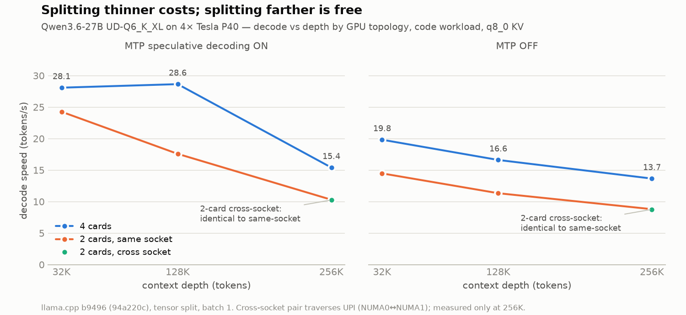
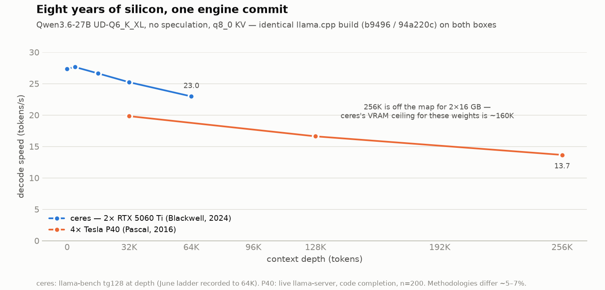
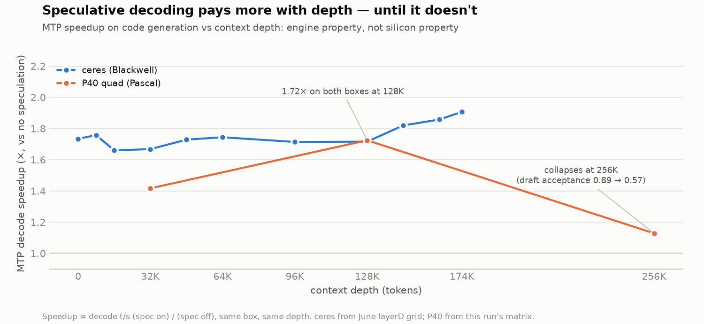
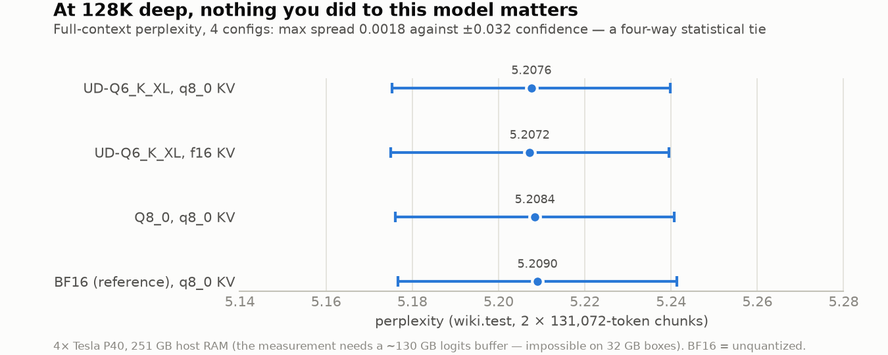

# Qwen3.6-27B on 4× Tesla P40: what $200 GPUs still do in 2026

An overnight benchmark of **Qwen3.6-27B** (Unsloth GGUF, llama.cpp) on a
rented 4× Tesla P40 box — 96 GB of 2016-vintage datacenter VRAM — designed as
a controlled cross-check of a June 2026 study of the same model on a modern
2× RTX 5060 Ti box ("ceres"). **Same engine build on both machines
(llama.cpp b9496 / `94a220c`)**, same weights, same sampling, so the deltas
are silicon, not software.

| | this box | ceres (comparison) |
|---|---|---|
| GPUs | 4× Tesla P40 24GB | 2× RTX 5060 Ti 16GB |
| VRAM | 96 GB | 32 GB |
| silicon | Pascal, 2016 — no tensor cores, crippled FP16 | Blackwell, 2024 |
| host RAM | 251 GB | 32 GB |
| P2P | native (datacenter) | requires patched kernel module |
| decode @ 32K (this quant) | 19.8 t/s (28.1 with MTP) | ~25 t/s (~40+ with MTP) |
| max context, UD-Q6_K_XL + q8 KV | **262K (model max), easily** | ~160K (VRAM ceiling) |

## The four results

### 1. Splitting thinner costs; splitting farther is free


Four cards beat two at every depth — but the pair placed *across* CPU sockets
is **identical** to the pair on one socket (10.3 = 10.3 t/s at 256K, with and
without speculation). The NUMA/UPI wall everyone plans around does not exist
at these traffic levels (~1 GB/s per card, <10% of PCIe Gen3 x16). Tensor
split's cost is per-split synchronization, not interconnect distance:
optimize card *count*, not card *placement*.

### 2. Eight years of silicon, one engine commit


The 2016 box holds ~60–70% of Blackwell's decode speed on the same commit —
and keeps going to 256K context, which physically cannot fit on the 32 GB
box. Different points on a capacity/speed frontier, not "better and worse."

### 3. Speculative decoding pays more with depth — until it doesn't


MTP speedup on code hits **1.72× at 128K on both boxes** — identical, which
argues the payoff is an engine/model property, not a silicon property. New
here: at 256K it collapses to 1.13× (draft acceptance 0.89 → 0.57). The June
study never measured past 174K, so whether Blackwell collapses too is open.

### 4. At 128K deep, nothing you did to this model matters


The measurement the 32 GB box physically couldn't run: full 128K-context
perplexity needs a ~130 GB host logits buffer (`n_ctx × 248k vocab × 4 B`).
With 251 GB of RAM it's just slow. Result: UD-Q6_K_XL with q8_0 KV, with f16
KV, Q8_0 weights, and the **unquantized BF16 reference** land within 0.002
ppl of each other (±0.032 CI) — a four-way statistical tie in which the
reference nominally finishes last.

Also measured: **Q8_0 weights are the fastest quant on Pascal** (39.3 t/s at
32K with MTP — simple dequant suits the silicon); **f16 KV beats q8_0 KV
here too** (+14% at 256K, matching the Blackwell result on opposite
hardware); vision (mmproj) works at 135 t/s image prefill / ~32 t/s decode.

## Repo map

```
bench_results/    raw outputs: 28-cell speed matrix (matrix.jsonl), 4 ppl
                  runs, vision smoke test, GPU telemetry (dmon.log), full
                  run log, per-config server logs, engine version stamp
plots/            the four charts + make_plots.py (regenerates them from
                  bench_results/ + ceres_reference/)
harness/          what produced the data: run_all.sh (orchestrator with
                  auto-stop), bench_driver.py (shared-prefix incremental
                  prefill cells), repair_same2.sh, vision_smoke.py,
                  passB.py (the code workload)
ceres_reference/  the two small June-study series the comparison charts
                  draw on (2× 5060 Ti decode ladder + MTP-by-depth)
```

## Method, briefly

- 28 speed cells: {UD-Q6_K_XL, Q8_0, BF16} × {4-card, 2-card same-socket,
  2-card cross-socket} × {MTP on, off} × {32K, 128K, 256K} × {q8_0, f16 KV},
  as applicable. Live `llama-server`, code-completion workload, batch 1,
  tensor split, flash-attn, production sampling (temp 1.0 / top-p 0.95 /
  top-k 20). Each config pays its 256K prefill once via shared-prefix
  incremental caching (depths measured ascending).
- Perplexity: `llama-perplexity -c 131072 --chunks 2` over WikiText-2 test.
- Vast.ai container survival notes, since they cost hours: the image's
  prebuilt llama.cpp targets sm_75+ and cannot run on Pascal (build from
  source, `CMAKE_CUDA_ARCHITECTURES=61`, CUDA ≤12.x); `/dev/shm` is noexec
  (build on disk, source in tmpfs); `numactl` mempolicy syscalls are blocked
  by seccomp (use `taskset`); the 128 GB disk is smaller than one 27B in
  four precisions (large shards can live in tmpfs with symlinks — if you
  have the RAM, and mind that a stop wipes them).
- The box auto-stopped (not destroyed) itself at the end of the run via the
  Vast API — see the tail of `harness/run_all.sh`.

## Follow-up: does P2P actually matter here? (spoiler: no)

These are datacenter cards, so peer-to-peer DMA works natively — the thing
consumer cards fuse off. We measured what it's worth, two ways.

**Transport level** (`harness/p2p_lat.cu`, results in
`p2p_ab/transport_matrix.csv`): per-pair 4-byte ping-pong latency and 128 MiB
bandwidth, peer DMA vs host-staged.

| | peer DMA | host-staged |
|---|---|---|
| latency (all pairs) | **~2.1–3.5 µs** | ~6.7–10.4 µs |
| bandwidth, same-socket pairs | **~10.2 GB/s** | ~6.8–7.5 GB/s |
| bandwidth, cross-socket pairs | ~8.3–9.1 GB/s | ~6.8–7.5 GB/s |

P2P is ~3× lower latency and ~+30% bandwidth. Cross-socket costs ~15%
bandwidth but **zero latency** — which is the transport-level mechanism
behind chart 1's "NUMA wall doesn't exist" result: the per-layer all-reduces
are small and latency-bound, and latency is socket-invariant.

**Application level** (`p2p_ab/bench_*.json`): identical llama.cpp binary
with a one-line env guard around `cudaDeviceEnablePeerAccess`
(`GGML_CUDA_NO_PEER=1` → the driver host-stages the same copies, i.e. the
consumer-card code path). UD-Q6_K_XL, tensor split, r=3:

| config | peer on | peer off |
|---|---|---|
| 4-card tg128 | 21.21 ± 0.14 t/s | 21.21 ± 0.13 t/s |
| 4-card pp512 | 344.6 t/s | 344.5 t/s |
| 2-card tg128 | 15.69 ± 0.07 t/s | 15.69 ± 0.07 t/s |

**Zero difference**, and PCIe counters showed identical bus traffic in both
arms (~1.1 GB/s per active GPU). The arithmetic: a layer's all-reduce moves
~12 KB; the peer-vs-staged latency delta (~6 µs × ~120 copies/token) sums to
~0.4 ms against a 47 ms decode step — under 1%. At Pascal compute speeds,
transport is never the bottleneck, so the datacenter-P2P advantage that shows
up clearly at the transport level is invisible end-to-end.

### Blackwell postscript (`ceres_ab/`)

We then checked the modern-silicon side on the 2× RTX 5060 Ti box, which had
P2P force-enabled in June via a patched open-kernel-module (NCCL showed
+20–27% busbw, −24% latency at the time — the numbers that make people say
"you must enable P2P").

- **June's own before/after** (`june_p2p_beforeafter.csv`, same llama-bench
  methodology 10 days apart): P2P was worth **+0–2.1% decode at shallow
  depth, ~0% at 64K+** — within day-to-day variance. The NCCL win never
  reached tokens/sec.
- **Transport matrix on this platform** (`transport_matrix_ceres.csv`): both
  modes measure ~6.4 µs / 13.2 GB/s — PCIe Gen5 host-staging is already fast
  enough that peer DMA has nothing to add for memcpy-path transfers.
- **The accidental clincher:** a routine driver userspace upgrade (595.84
  over the 595.71-p2p module) had silently *revoked* peer access
  (`cudaDeviceCanAccessPeer` = 0) at some point before our test — production
  inference ran P2P-less for weeks and **nobody noticed**. (This also means
  our fresh env-guard A/B on this box was unwittingly staged-vs-staged —
  28.95 vs 28.90 t/s, `bench_*.json` — which certifies the noise floor, while
  the June before/after carries the with/without-P2P comparison.)

Across two silicon generations, three measurement approaches, and one
accidental natural experiment: **for llama.cpp tensor-split batch-1
inference, P2P is not a knob that matters.** State your batch size before
citing interconnect requirements.

## Provenance

June ceres study (full quant ladder, KLD tail analysis, retrieval, evals,
capacity probes): separate repo/writeup. `ceres_reference/` carries only the
two series the charts here need.
